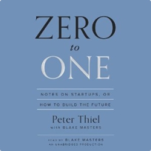
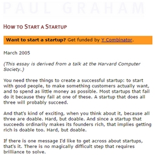

# Paul Graham: How to start a startup

## I - A Vision of Startup Culture
### Readings
- Peter Thiel on Startups, April 2012, Blake Masters

- From Zero to One, Peter Thiel

- How to start a startup, Paul Graham

### Summary
- How to start a startup, Paul Graham
   1. Start with good people
       - You want *animals*, passionate and addicted about their job
       - Three qualities:
           - Smart
           - Get things done
           - Bearable personality
       - Get them from a network of friends is great
       - Only business people as founders is bad as they don't know limitations and possibilities
       - Get **1** business person to focus on what customers want, although tech can do it as well.
   2. Make something customers actually want
       - Look at something people are trying to do
       - Figure out how to do it in a way that does not suck
       - The idea is worth nothing without its people
       - Make an MVP ASAP
   3. Spend as little money as possible

## II - NAE Grand Challenges

## III - The Early Internet Bubble

## IV - Wearable Computing Vision

## V - Wearables and Healthcare

## VI - Personalized Diagnostics and Medicine

## VII - Personalized learning

### Summary
- Learnt
  - Continuous data mining for students
  - Social media data sold to insurance companies
  - Internet = Distribution + Data mining (personalization)
  - Different meanings of adaptive learning
- How it affected me
  - Data mining for food preferences
  
## VIII - Green computing and alternative energy