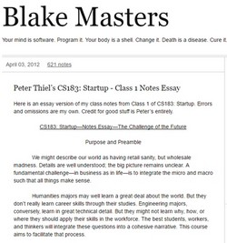
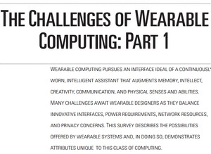
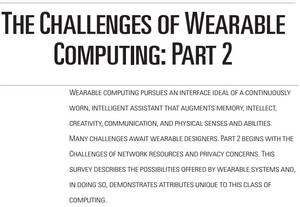
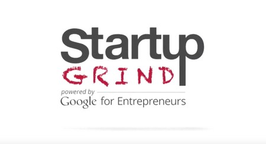
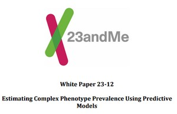
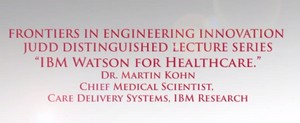
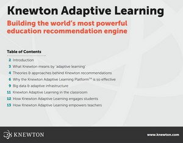
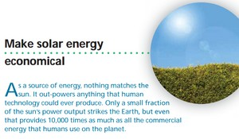
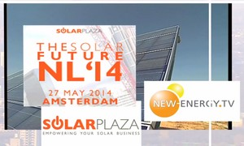

# Startup

## Main early stages
1. Idea incubation
    - Team and general area of startup
    - Problem idea
2. Idea development
    - Pitch Deck
    - First feels
    - Competition: Should you do it?
    - How big is the problem
        - Revenue Model
        - Go to market strategy
        - Projected revenue vs time
3. Early MVP
    - Feedback and product-market fit
        - Customer discovery, 25 informal interviews
    - Wire frame and MVP specs
    - Dumb version
    - What makes you and your product special?
4. Final MVP
5. Final presentation

## Pitch Deck
- 11 to 12 slides deck
1. Problem
2. Mission statement
3. Core idea
4. Why you (team)
5. Technology and coolness
6. Competition
7. Customers value proposition
8. Go to market strategy
9. Revenue Model
10. Traction
11. Funds

## Customers feedback
- Indirect questions
- 25 informal interviews
- Feedback from and to MVP specs
- Steps
    1. Set the stage
    2. Do not pitch
    3. Talk about the problem
    4. Refine

## MVP Specs

## Lean Launchpad canvas

## Exec summary
1. Overview (2 - 3 sentences)
2. Problem & opportunity (3 - 4 bullet points)
    - How big is the problem?
        - Number of people or percentages
        - Total potential money
    - Why no one has solved it?
    - What would be the impact if solved?
3. Solution in a nutshell
    - Coolness
    - Appropriate
    - Adoption
4. Revenue Opportunity
    - Number of customers X (Revenue/Cost)
    - Number of customers depends on Growth
    - Revenue/Cost depends on competitors
5. Team (1 sentence per name)
    - End of page 1
6. Product offering
7. Traction
8. Competition
    - Use dimensional graphs with dimensions where you are higher than competitors
9. Funds & use on 12-24 months

***

# Cases Study

## I - A Vision of Startup Culture
### Readings
- **Peter Thiel** on Startups, April 2012, Blake Masters

- **From Zero to One**, *Peter Thiel*

- **How to start a startup**, *Paul Graham*

### Summary
- How to start a startup, Paul Graham
   1. Start with good people
       - You want *animals*, passionate and addicted about their job
       - Three qualities:
           - Smart
           - Get things done
           - Bearable personality
       - Get them from a network of friends is great
       - Only business people as founders is bad as they don't know limitations and possibilities
       - Get **1** business person to focus on what customers want, although tech can do it as well.
   2. Make something customers actually want
       - Look at something people are trying to do
       - Figure out how to do it in a way that does not suck
       - The idea is worth nothing without its people
       - Make an MVP ASAP
   3. Spend as little money as possible

   
   
## II - NAE Grand Challenges
### Readings
- **NAE Grand Technical Challenges for the Century**

Also available [here](http://www.northeastern.edu/academic-plan/wp-content/uploads/2015/10/NAE-Grand-Challenges-2008.pdf)

### Summary
- What I learnt
- How it affected me

## III - The Early Internet Bubble: the Inktomi story
### Videos
- **Inktomi's Wild Ride** - *A Personal View of the Internet Bubble*, E. Brewer, Talk at Computer History Museum, 2004

### Summary
- What I learnt
- How it affected me

## IV - Wearable Computing Vision
### Readings
- *The Challenges of Wearable Computing*, Thad Starner

### Summary
- What I learnt
- How it affected me

## V - Wearables and Healthcare: Fitbit and Google
### Videos
- James Park (**Fitbit**) and Jeff Clavier (**SoftTech VC**) at *Startup Grind 2014*

- **Google** *Diabetes Contact Lenses*

### Summary
- What I learnt
- How it affected me

## VI - Personalized Diagnostics and Medicine: 23andme and Watson
### Readings
- **23andme** white paper *Estimating Complex Phenotype	Prevalence Using Predictive Models*

- **23andme** white paper *Estimating Carrier Frequency, Carrier Detection Rate, and Post-Test Carrier Risk for Recessive Disorders*

### Videos
- **23andMe** *Empowering Consumer-Enabled Research* at Berkeley University of California

- **IBM** *Watson* for Healthcare

### Summary
- What I learnt
- How it affected me

## VII - Personalized learning: Knewton
### Readings
- **Knewton** adaptive learning *white paper*

### Videos
- **Knewton** Adaptive Learning and its role in Learning and Online Education featuring *Jose Ferreira*

### Summary
- What I learnt
  - Continuous data mining for students
  - Social media data sold to insurance companies
  - Internet = Distribution + Data mining (personalization)
  - Different meanings of adaptive learning
- How it affected me
  - Data mining for food preferences
  
## VIII - Green computing and alternative energy
### Readings
- **NAE grand challenges for engineers** *Make Solar economical*

### Videos
- *Bill Weihl*’s role at **Google**

- *Green DataCenters - Power and Cooling in the Modern World*

- Solar energy storage

### Summary
- What I learnt
- How it affected me